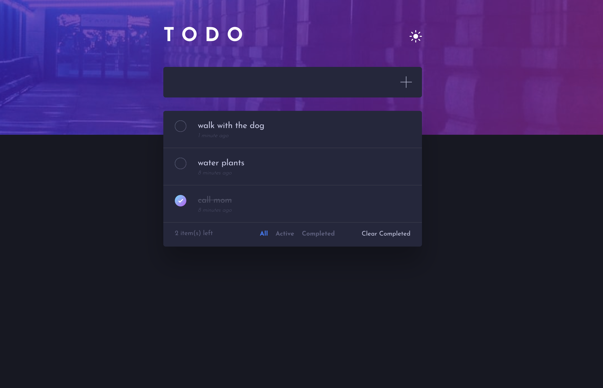

# TODO List

A web application that allows users to add, and delete tasks they want to work on, and also mark tasks as complete without deleting them.

## Getting Started

1. Type `yarn install` to install all dependencies.
2. Type `yarn start` to run the app in the development mode.

Open [http://localhost:3000](http://localhost:3000) to view it in the browser.
